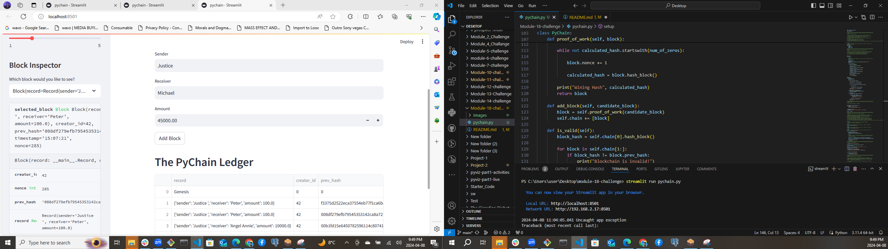
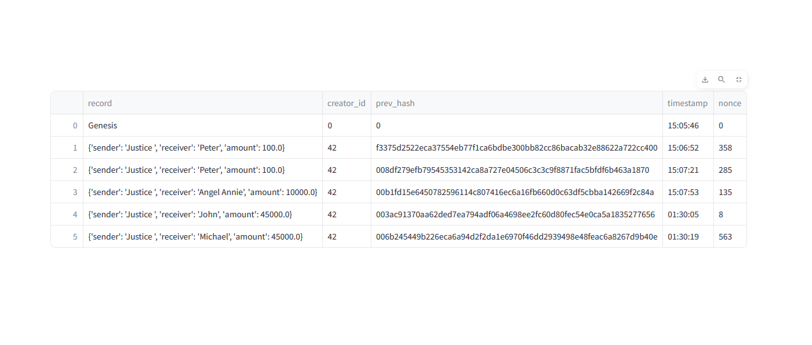

# PyChain Ledger

As a fintech engineer working at one of the world's largest banks, I was tasked with leading the development of a decentralized finance (DeFi) system. This system required building a blockchain-based ledger with a user-friendly web interface to facilitate financial transactions among partner banks and ensure data integrity.

## Steps

1. **Create Record Data Class:** Develop a new data class named `Record` to define the structure of financial transaction records stored in the ledger blocks.

2. **Modify Block Data Class:** Update the existing `Block` data class to accommodate `Record` data, enabling storage of transaction details within each block.

3. **Add User Inputs:** Enhance the Streamlit interface by incorporating user input fields for capturing sender, receiver, and transaction amount information.

4. **Test PyChain Ledger:** Validate the functionality of the PyChain ledger by storing transaction records and ensuring the integrity of the blockchain.

## Explanation

I utilized the streamlit open-source Python library to create an interactive and customizable web application from Python scripts.

* To execute the application, I ran the command 'streamlit run pychain.py', which launched a new browser window hosting the interactive PyChain ledger.

Through the application, I added new blocks and stored transaction records within the PyChain ledger. Each transaction included sender, receiver, and amount details, providing a comprehensive view of financial activities.

Furthermore, I conducted validation checks on the PyChain ledger, ensuring the accuracy and integrity of stored data.

Additionally, the application featured a block inspector, allowing for detailed examination of individual blocks within the ledger.

